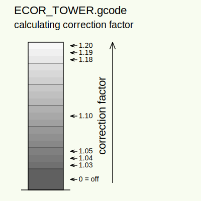

# ECOR_TOWER.gcode

### extruder linearity correction calibration object

## Download: [ECOR_TOWER.gcode](https://raw.githubusercontent.com/XPila/Prusa3D-Test-Objects/master/MK3/ECOR_TOWER/PLA_MK3_ECOR_TOWER.gcode)

* Printer: MK3
* Dimensions: 25x25x105mm
* Printing time: ~20min
* Layer height: 200um
* Layer count: 525
* Filament: Prusa PLA silver

## Description:
This object can be used to find linearity correction factor for extruder motor.
Object is hollow prism (single perimeter) with square base 25x25mm, height 105mm.
Each layer starting at concrete stepper motor phase. Starting phase is shifted by two microsteps every layer. This produces periodical diagonal interference on object surface. Visibility of the interference depends on extruder motor linearity distortion (zero distortion == not visible).
Object is verticaly divided to seven segments separated by lines. In first bottom segment is correction disabled (off), next six segments are divided to three sub-segments (18 sub-segments total). Correction factor is changed for each subsegment in range 1.03-1.20 by 0.01 steps. For most printers is minimal distortion around 1.10 (vertical center of object).

